# DevHub — Architecture &amp; Data Flows

> Complete, SDLC-style architecture documentation for the **DevHub** learning hub:
> the static visualizer frontend and the `devhub-backend` Spring Boot API.
> Every diagram below is [Mermaid](https://mermaid.js.org) and renders on GitHub.
>
> **Companion docs:** [README](../README.md) (run/deploy) · [DEVHUB-GUIDE](DEVHUB-GUIDE.md) (the 18 learning tracks) · [CODE-MAP](CODE-MAP.md) (every file: what it is, who loads it, what breaks if you change it) · [API-REFERENCE](API-REFERENCE.md) (every endpoint) · [SECURITY](SECURITY.md) (auth model) · [HELP](../HELP.md) (command-line runbook).

---

## Table of contents

1. [Purpose &amp; scope](#1-purpose--scope)
2. [Quality attributes (NFRs)](#2-quality-attributes-nfrs)
3. [C4 L1 — System context](#3-c4-l1--system-context)
4. [C4 L2 — Containers](#4-c4-l2--containers)
5. [C4 L3 — Backend components](#5-c4-l3--backend-components)
6. [Frontend runtime architecture](#6-frontend-runtime-architecture)
7. [Data model](#7-data-model)
8. [The two security filter chains](#8-the-two-security-filter-chains)
9. [Use-case data flows](#9-use-case-data-flows)
   - [9.1 Registration](#91-registration-first-party)
   - [9.2 Login (first-party HS256)](#92-login-first-party-hs256)
   - [9.3 OIDC login (self-hosted RS256)](#93-oidc-login-self-hosted-rs256)
   - [9.4 Per-request token validation](#94-per-request-token-validation)
   - [9.5 Admin / RBAC (403 vs 200)](#95-admin--rbac-403-vs-200)
   - [9.6 Navigate — click a new section](#96-navigate--click-a-new-section)
   - [9.7 View a section + auto-visit + mark learned](#97-view-a-section--auto-visit--mark-learned)
   - [9.8 Progress sync (authed / anonymous / import)](#98-progress-sync-authed--anonymous--import)
   - [9.9 Account stats panel](#99-account-stats-panel)
   - [9.10 Server-side code execution](#910-server-side-code-execution)
10. [Deployment topologies](#10-deployment-topologies)
11. [Security model &amp; hardening](#11-security-model--hardening)
12. [SDLC — build, test, extend](#12-sdlc--build-test-extend)
13. [Known limitations &amp; future work](#13-known-limitations--future-work)

---

## 1. Purpose &amp; scope

DevHub is a learning hub: **344+ self-contained browser "visualizer" pages** across 18 tracks, plus a **small Spring Boot 4 backend** that adds optional accounts, cross-device progress sync, a self-hosted OIDC issuer for teaching token validation, and a sandboxed server-side code runner that powers the *live* playgrounds.

Two design tenets shape everything:

- **The visualizers are static and dependency-free.** Each page is one HTML file (vanilla JS, links `devhub.css`, sets a `track-*` body class). It opens by double-click with no server. This keeps the teaching content trivially hostable (GitHub Pages) and individually shareable.
- **The backend is a teaching instrument, not a product.** It deliberately exposes *both* a first-party **HS256** auth flow *and* an OIDC **RS256** resource-server flow so the pages can demonstrate the two side by side, plus a gated `/api/run/*` executor.

---

## 2. Quality attributes (NFRs)

| Attribute | How it's met |
|-----------|--------------|
| **Portability** | One config wire (`config.js` → `DEVHUB_API_BASE`) serves local, Docker, and Pages+cloud. Backend is a single layered JAR / Alpine image. |
| **Security** | Stateless JWT, two isolated filter chains, RBAC via `@PreAuthorize`, code-exec off in prod, fail-fast on a missing/weak JWT secret, no default creds in prod. |
| **Low friction** | Anonymous use works offline (localStorage); accounts are optional. Dev boots with an empty `.env`. |
| **Statelessness** | No server session; tokens carry identity + roles. Horizontally scalable except for the in-memory OIDC key (see §13). |
| **Observability** | Actuator `health`/`info` only; Docker/Render health probes hit `/actuator/health`. |
| **Testability** | 20 backend tests (MockMvc integration + unit); every frontend page passes a structural validator before registration. |

---

## 3. C4 L1 — System context

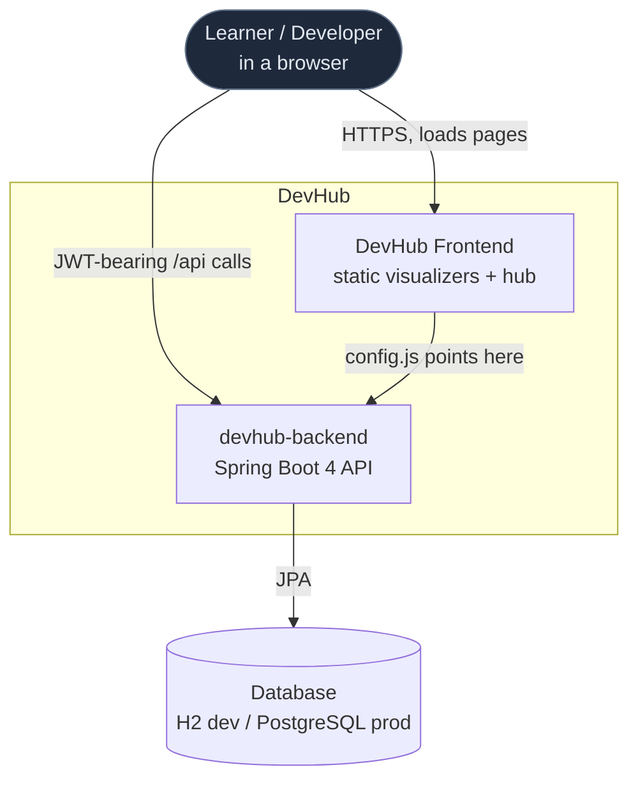

The learner loads static pages from the **frontend** and—only when signed in or using a live playground—makes JWT-bearing calls to the **backend**, which persists accounts and progress in a relational DB. The backend also acts as its own OIDC issuer/resource-server (no external IdP needed).

---

## 4. C4 L2 — Containers

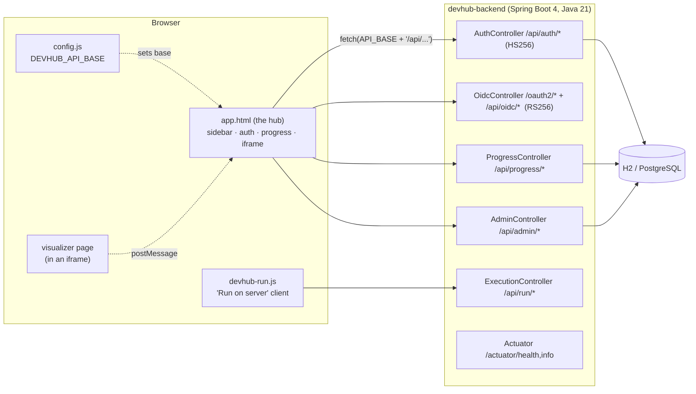

- **`app.html`** is the shell: sidebar (the `TRACKS` array), the auth modal, progress state, and an `<iframe id="viewer">` that hosts the selected visualizer.
- A **visualizer** runs inside that iframe and talks back to the hub via `postMessage` (toggle-learned, cross-link navigation).
- **`config.js`** is the single integration point — it sets `window.DEVHUB_API_BASE`; everything else derives `API_BASE` from it.
- The backend is five controllers behind two security filter chains (§8).

---

## 5. C4 L3 — Backend components

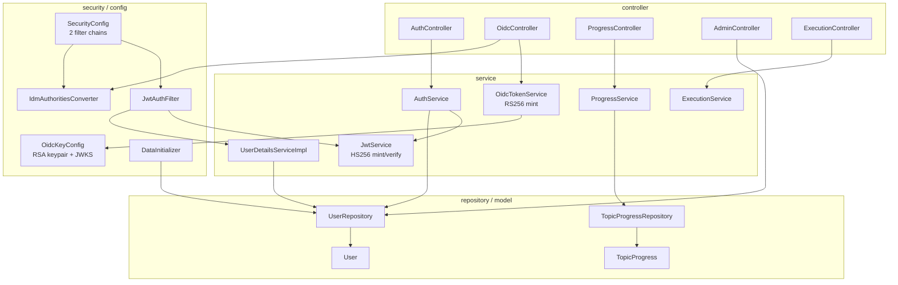

| Package | Responsibility |
|---------|----------------|
| `controller` | The 5 REST controllers (auth, oidc, progress, admin, run) |
| `service` | `AuthService`, `JwtService` (HS256), `OidcTokenService` (RS256), `ProgressService`, `ExecutionService`, `UserDetailsServiceImpl` |
| `security`/`config` | `SecurityConfig` (the two chains), `JwtAuthFilter`, `IdmAuthoritiesConverter`, `OidcKeyConfig` (RSA + JWKS), `DataInitializer` (dev seeding) |
| `repository`/`model` | `UserRepository`, `TopicProgressRepository`; `User`, `TopicProgress`, `Role`, `ProgressStatus`, `Idm` |
| `dto` | request/response records (`AuthResponse`, `OidcTokenResponse`, `ProgressResponse`, `StatsResponse`, …) |

---

## 6. Frontend runtime architecture

The hub is a single hand-written page (no framework). The pieces that matter for data flow:

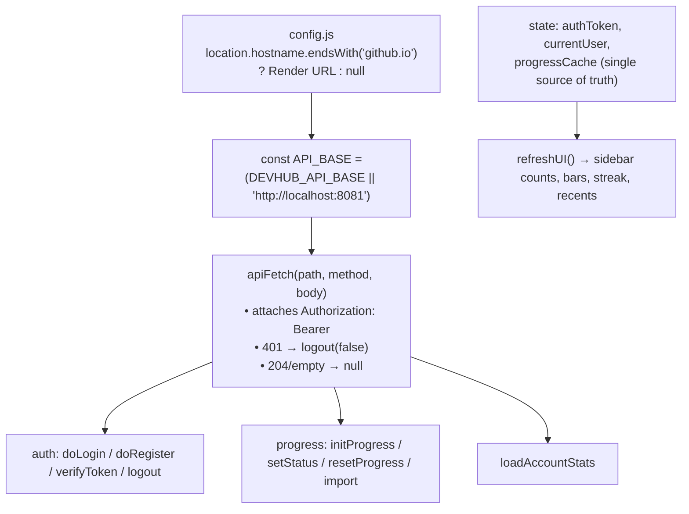

- **`API_BASE` is computed once** from `config.js`. `null` → `http://localhost:8081`, which is the backend in local dev *and* the nginx origin in Docker.
- **`apiFetch`** centralizes every call: it injects the bearer token, treats a `401` as "log out locally" (so a stale token degrades to anonymous mode), and tolerates the backend being unreachable (falls back to localStorage).
- **`progressCache`** is the single source of truth for the UI; `refreshUI()` re-derives every count, bar, and badge from it.
- **Deep-linking:** `navigate()` sets `location.hash` to the page slug; on boot the hash is resolved back to a sidebar link and opened.

---

## 7. Data model

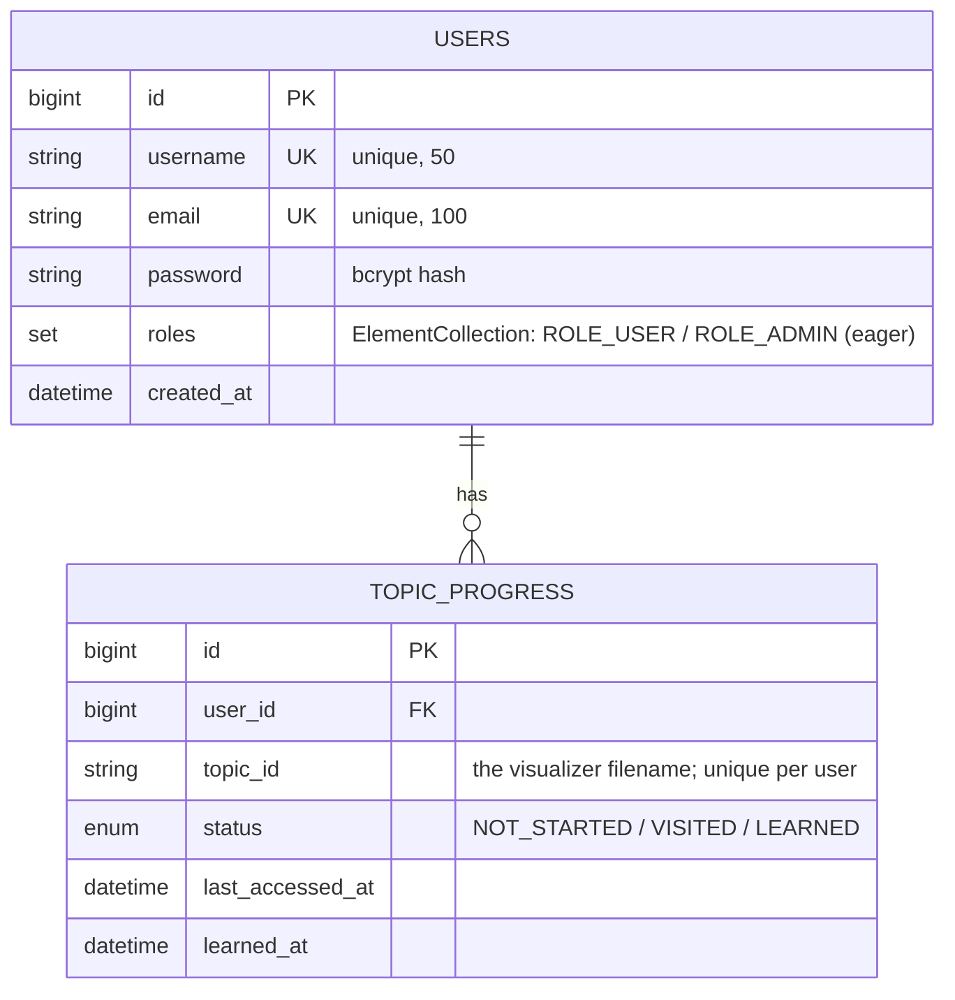

- **`User`** implements `UserDetails`; `roles` is an eager `@ElementCollection` of the `Role` enum (so authorities are available the moment the user loads — no lazy hit).
- **`TopicProgress`** is one row per (user, topic), with a `UNIQUE(user_id, topic_id)` constraint; `topic_id` is the visualizer's filename. Its `user` `@ManyToOne` is `LAZY` but is never read during DTO mapping (so `spring.jpa.open-in-view=false` is safe).
- Schema: **H2 in-memory** in dev (`create-drop`), **PostgreSQL** in prod (`ddl-auto: update`).

---

## 8. The two security filter chains

`SecurityConfig` registers **two** `SecurityFilterChain` beans, ordered. Spring picks the first whose matcher accepts the request.

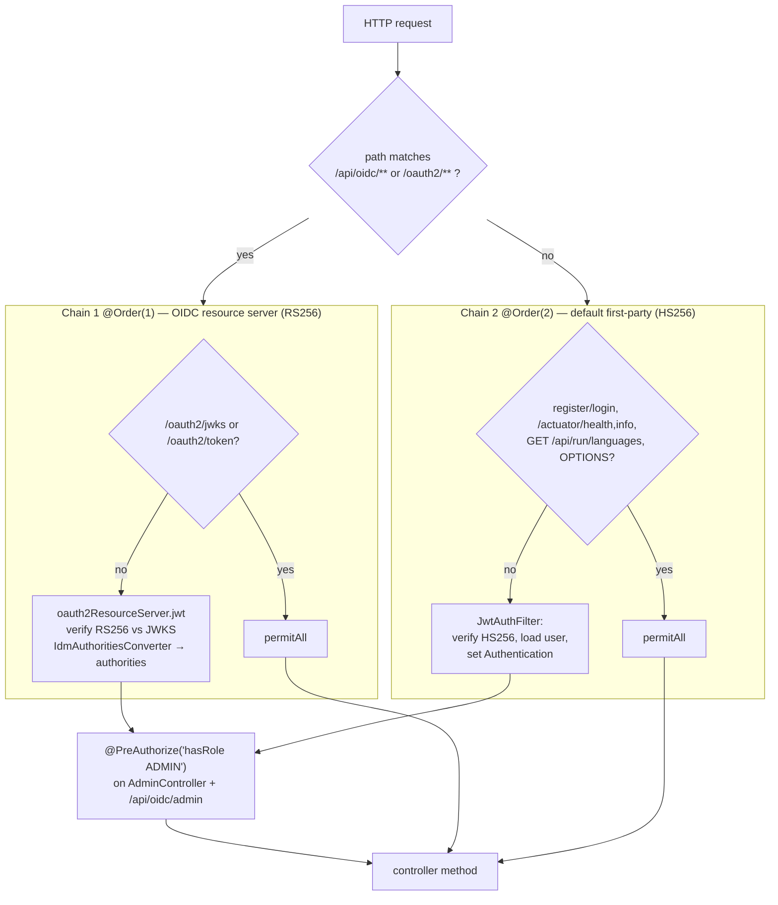

- **Chain 1** validates **RS256** tokens (minted by `POST /oauth2/token`) against the public key published at `/oauth2/jwks`, mapping IdM-shaped claims (`roles`, `scp`, `realm_access.roles`, `group`) to authorities via `IdmAuthoritiesConverter`.
- **Chain 2** (default) validates **first-party HS256** tokens via `JwtAuthFilter`.
- `@EnableMethodSecurity` turns on `@PreAuthorize`, the real RBAC gate (URL rules + method rules in lockstep).
- Both chains are **stateless** (`SessionCreationPolicy.STATELESS`), CSRF off (token-in-header, no cookies), CORS from an explicit origin list.

---

## 9. Use-case data flows

### 9.1 Registration (first-party)

```mermaid
sequenceDiagram
    participant U as Browser (app.html)
    participant A as AuthController
    participant S as AuthService
    participant R as UserRepository
    U->>A: POST /api/auth/register {username,email,password}
    A->>S: register(req)
    S->>R: existsByUsername / existsByEmail
    alt taken
        R-->>S: true
        S-->>A: throws IllegalArgumentException
        A-->>U: 409 Conflict {error}
    else available
        S->>S: bcrypt-encode password, default ROLE_USER
        S->>R: save(User)
        S->>S: JwtService.generateToken (HS256, roles claim)
        S-->>A: AuthResponse {token, roles, ...}
        A-->>U: 201 Created
        U->>U: applyAuthData (store token+user) → initProgress → loadAccountStats
    end
```

### 9.2 Login (first-party HS256)

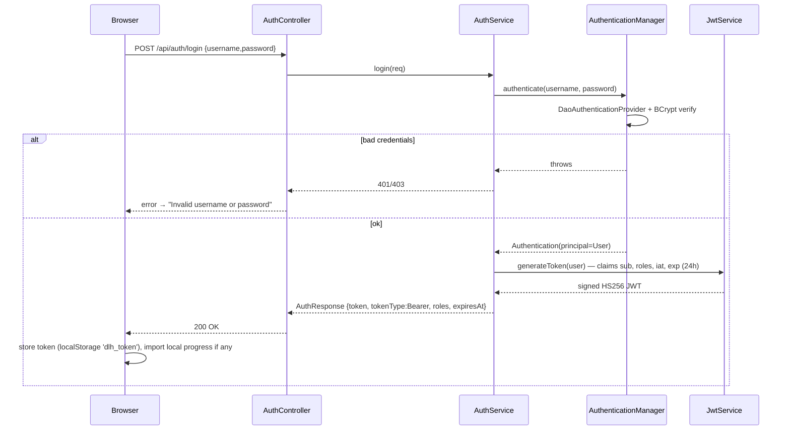

### 9.3 OIDC login (self-hosted RS256)

The "fetch a real token" path the `Auth & Identity (Live)` and JWT playgrounds use.

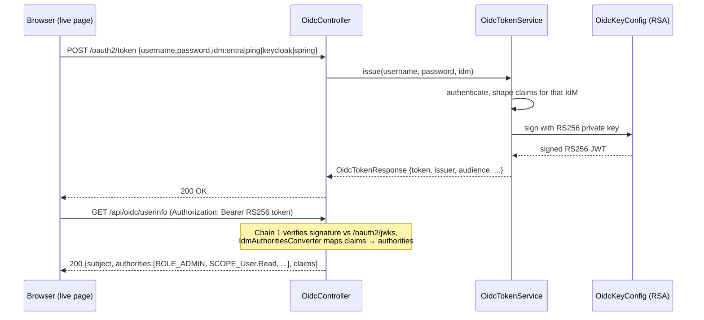

### 9.4 Per-request token validation

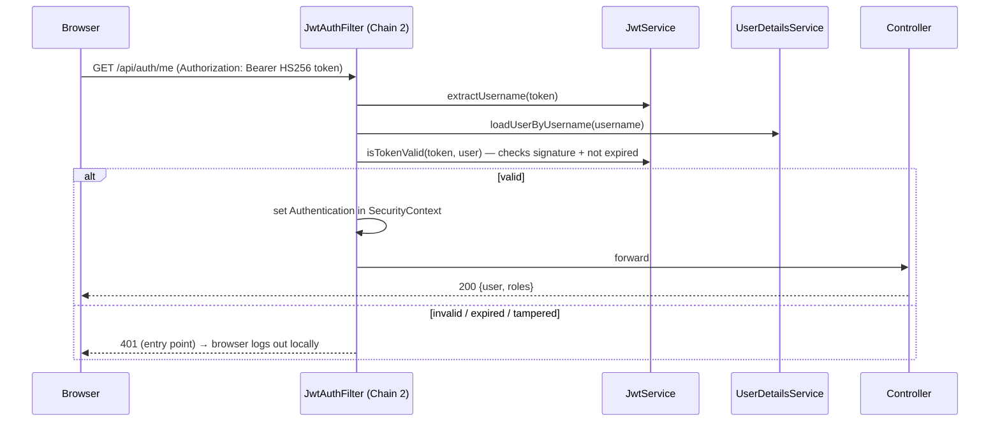

### 9.5 Admin / RBAC (403 vs 200)

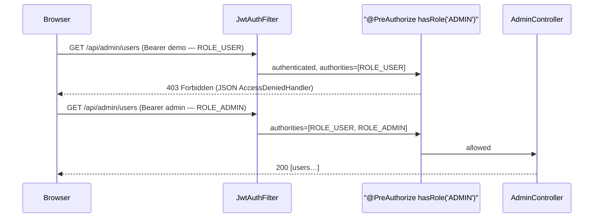

### 9.6 Navigate — click a new section

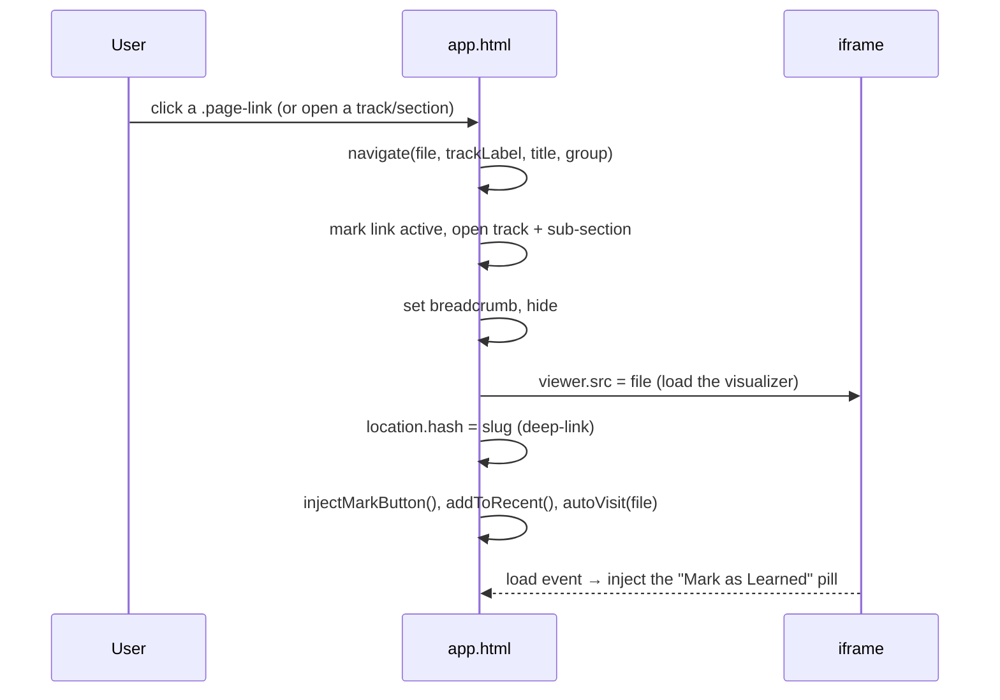

> A guard watches the iframe `load` event: if a back-link tries to load `app.html`/`index.html` *inside* the viewer (the "nested hub" bug), it resets to the hub home instead.

### 9.7 View a section + auto-visit + mark learned

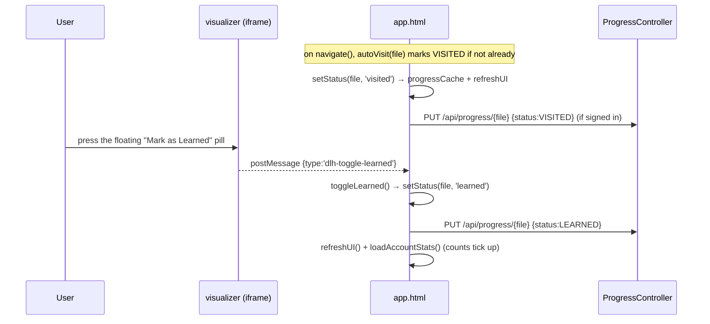

> Pressing **`L`** in the hub does the same as the in-iframe pill (keyboard shortcut → `toggleLearned`).

### 9.8 Progress sync (authed / anonymous / import)

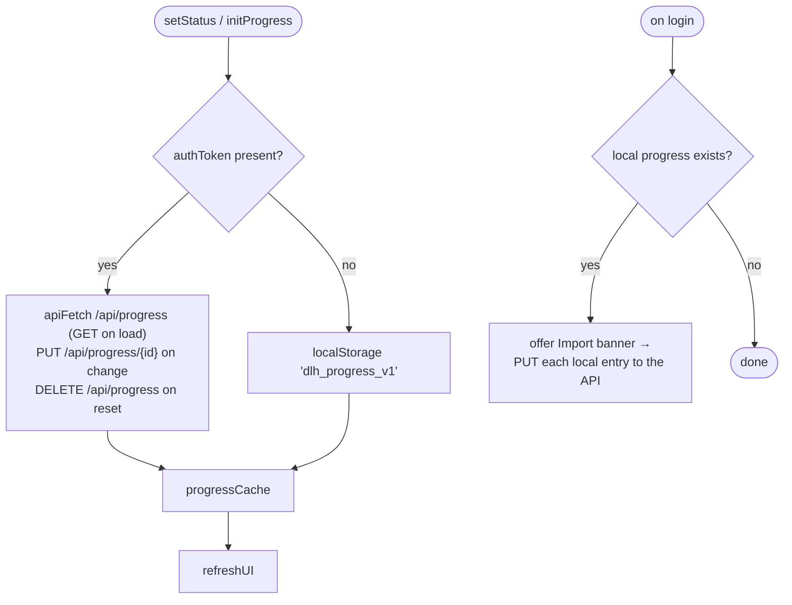

- **Anonymous** progress lives in `localStorage` and works fully offline.
- **Signed in**, progress is read once (`GET /api/progress`) and each change is `PUT`/`DELETE`d to the server.
- **On login**, if anonymous progress exists, the user is offered a one-click **import** that replays each entry to the API.
- If the backend is unreachable, `apiFetch` returns `null` and the UI silently falls back to localStorage.

### 9.9 Account stats panel

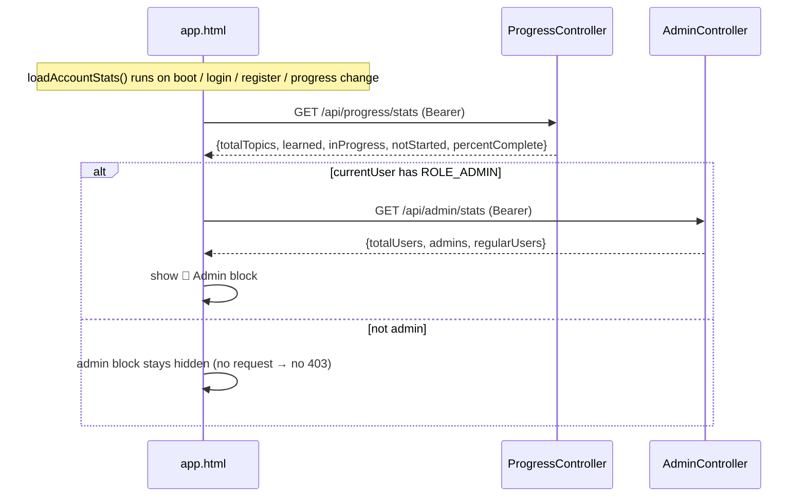

> The admin call is **gated on the client by `roles.includes('ROLE_ADMIN')`** so a normal user never even fires a request that would (correctly) come back `403`.

### 9.10 Server-side code execution

```mermaid
sequenceDiagram
    participant PG as Playground page
    participant Run as devhub-run.js
    participant Auth as AuthController
    participant Exec as ExecutionController
    participant Svc as ExecutionService
    PG->>Run: DevHubRun.exec(lang, code, stdin)
    Run->>Run: token from localStorage?
    alt no token / stale
        Run->>Auth: POST /api/auth/login {demo/demo12345}
        Auth-->>Run: token (store 'dlh_token')
    end
    Run->>Exec: POST /api/run/{lang} {code, stdin}  (Bearer)
    Note over Exec: auth-gated (an open runner is RCE);<br/>503 if app.exec.enabled=false (prod default)
    Exec->>Svc: run(language, code, stdin)
    Svc->>Svc: child process · wall-clock timeout · output cap ·<br/>sanitized env (PATH only) · temp dir · non-root
    Svc-->>Exec: ExecResult {stdout, stderr, exitCode, durationMs, timedOut}
    Exec-->>Run: 200 result (or 401 stale → re-login → retry)
    Run-->>PG: {ok, status, result}
```

> `GET /api/run/languages` (public) advertises which runtimes are available so the UI can enable/disable "Run on server" per language.

---

## 10. Deployment topologies

The **one wire** is `frontend/config.js` → `window.DEVHUB_API_BASE`. Three supported modes:

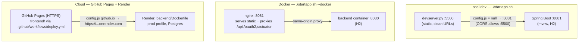

| Mode | Frontend | Backend | DB | API base |
|------|----------|---------|----|----------|
| **Local** | `devserver.py` :5500 | `mvnw spring-boot:run` :8081 | H2 | `localhost:8081` (cross-origin, CORS-allowed) |
| **Docker** | nginx :8081 | container :8080 | H2 | `localhost:8081` (same-origin via nginx proxy) |
| **Cloud** | GitHub Pages (HTTPS) | Render (`backend/Dockerfile`, prod) | PostgreSQL | the Render HTTPS URL |

All three are mutually exclusive but each is fully working. Cloud requires the operator to set Render env vars (`JWT_SECRET`, `DATABASE_*`, `CORS_ALLOWED_ORIGINS`) and point `config.js` at the Render URL — see [README Part 2/3](../README.md#part-2--deploy-the-backend-render--postgresql).

---

## 11. Security model &amp; hardening

| Concern | Control |
|---------|---------|
| **Token integrity (first-party)** | HS256 signed with `app.jwt.secret`. **Required, no committed default** — base `application.yml` has no fallback; the `dev` profile supplies a dev-only key; prod fails startup without `JWT_SECRET`. `JwtService.@PostConstruct` rejects any secret < 256 bits. |
| **Token integrity (OIDC)** | RS256; private key in-memory (`OidcKeyConfig`), public key at `/oauth2/jwks`. |
| **AuthN** | `DaoAuthenticationProvider` + BCrypt; stateless (`STATELESS`). |
| **AuthZ** | Permission-by-role; `@PreAuthorize("hasRole('ADMIN')")` on admin endpoints (URL + method enforcement). |
| **Credentials** | BCrypt-hashed; never returned. **No default accounts in prod** (`DataInitializer` seeds only `dev`; prod opt-in via `APP_DEMO_*`). |
| **Code execution** | `POST /api/run/{lang}` is auth-gated (open runner = RCE) and **disabled in prod** (`EXEC_ENABLED=false`); child process runs non-root, with a wall-clock timeout, output cap, sanitized env (PATH only), and a per-run temp dir. |
| **CORS** | Explicit origin allow-list (`app.cors.allowed-origins`), credentials enabled, **no wildcard** with credentials. |
| **CSRF** | Disabled by design — token-in-header API with no cookies. |
| **Transport** | HTTPS required in cloud (Pages is HTTPS → mixed-content blocks any `http://` backend). |
| **Surface** | Actuator limited to `health`,`info`. |

---

## 12. SDLC — build, test, extend

**Build &amp; run**
- Local: `./startapp.sh` (or `dev.ps1`) — backend `:8081` + frontend `:5500`, opens the hub.
- Backend only: `./mvnw -f backend/pom.xml spring-boot:run`.
- Image: `backend/Dockerfile` (multi-stage → Alpine JRE, non-root, healthcheck).

**Test**
- Backend: `./mvnw -f backend/pom.xml test` — 20 tests (`AuthRoleIntegrationTest`, `OidcResourceServerTest` MockMvc integration; `JwtServiceTest`, `ExecutionServiceTest` unit; context-load smoke).
- Frontend: each visualizer passes a structural validator (inline-script JS syntax + `pfx` id wiring + `nodes`/`data-n` + `SCEN`/`data-s` consistency) before it's registered in `TRACKS`.

**Extend — add a visualizer page**
1. Create `frontend/<name>-visualizer.html` (link `devhub.css`, set the `track-*` body class, reuse the hero engine: a unique `pfx`, `SCEN`, `nodes`).
2. Register it in the `TRACKS` array in `app.html` (track → section → `{title, file, level}`).
3. Validate, then load the hub to confirm it appears.

**Extend — add an API endpoint**
1. Add the controller method (+ service/repo as needed).
2. If it needs auth, it falls under the default chain's `anyRequest().authenticated()`; add a public matcher in `SecurityConfig` only if it must be open; add `@PreAuthorize` for role gating.
3. Add a test (MockMvc) covering the happy path + the 401/403 path.

**CI/CD**
- `.github/workflows/deploy.yml` publishes `frontend/` to GitHub Pages on push to `master`.
- Backend deploys from `backend/Dockerfile` on the chosen host (Render shown).

---

## 13. Known limitations &amp; future work

- **OIDC key is in-memory** — generated at startup, so RS256 tokens don't survive a restart and a multi-instance deployment would have mismatched keys. A real deployment would persist/rotate a keypair (or use an external IdP).
- **No refresh tokens** — the first-party access token is long-lived (24h). Fine for a learning app; a production CIAM would add refresh + rotation.
- **No rate limiting / brute-force protection** on `/api/auth/login` or `/oauth2/token`.
- **`ddl-auto: update`** in prod (no migration tool) — acceptable here; a production app would use Flyway/Liquibase with `validate`.
- **Backend is otherwise stateless** and horizontally scalable; the only shared-state caveats are the in-memory OIDC key and (when enabled) the local code-runner.

---

*This document reflects the code as built. When you change a flow, controller, or the security config, update the corresponding diagram here so the architecture stays honest.*
